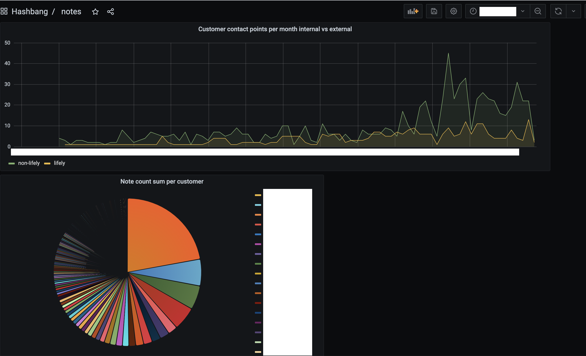

# markdown-notes-to-influx-grafana-dashboard-insights

a tool to convert my note format filenames into influxdb timeseries points for insights on customer relations



## input

the note filenames should have the following format with a YYYYMMDD timestamp in front: `/^\d{8}-\w*(-.*)*.md$/`

```
20210422-lifely-interview-jane.md
20210423-alpha-voorstel-voorbereiding.md
20210426-beta-koen.md
20210426-gamma-interview-joe.md
20210428-delta-handover.md
20210428-delta-intro-sander.md
20210428-lifely-review.md
20210428-lifely-upgradeable-technology-post-brains.md
```

## usage
initialize environment file with influxdb environment variable
```
cp .env.dist .env
```

install dependencies
```
npm install
```

ensure influxdb server is running and has a database configured
```
docker run -d -p 8086:8086 -v ~/influxdb/data:/var/lib/influxdb/data --restart always --name influxdb influxdb:1.7.9
docker exec -it influxdb /bin/bash
influx
create database notes
```

start the script
```
npm start ~/directory-with-notes/
```

optional: import `grafana-dashboard/notes-insight-dashboard.json` into grafana to view insights
